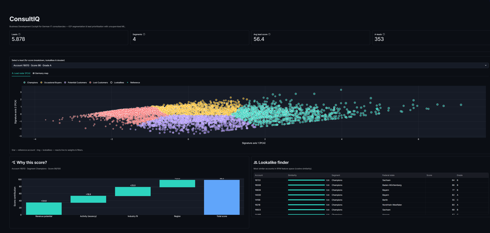
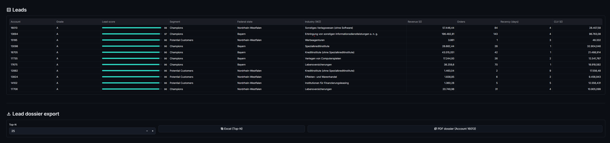
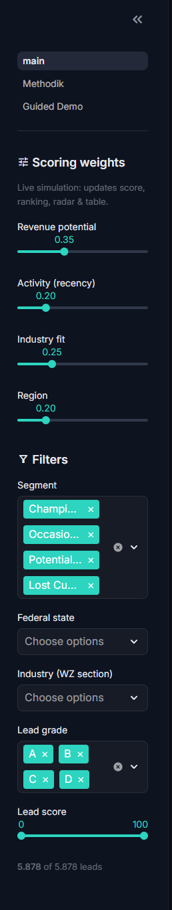

<!-- Diese Datei wird das README des ÖFFENTLICHEN Showcase-Repos (baris2828/ConsultIQ).
     Der Code liegt im PRIVATEN Repo; hier nur Schaufenster + Links. -->

# 🎯 ConsultIQ
### Business-Development-Cockpit für deutsche IT-Beratungen

*Unsupervised ML segmentiert profitable B2B-Kunden, definiert ICPs und priorisiert hochwertige Leads — im deutschen Marktkontext (WZ-2008-Branche + Bundesland).*

&nbsp;

---

## 🖼️ Vorschau

**Cockpit** — KPI-Leiste, 2D-Lead-Radar (PCA), Wasserfall „Why this score?" und Lookalike-Finder auf einen Blick:

| Lead-Tabelle & Dossier-Export | Scoring-Gewichte & Filter |
|:--:|:--:|
|  |  |

## 💡 Was ConsultIQ kann
- 🧩 **ICP-Segmentierung** — RFM + CLV → K-Means (Silhouette-Wahl) + DBSCAN.
- 🛰️ **2D-Lead-Radar** — PCA-Signaturansicht aller Accounts, Referenz & Lookalikes hervorgehoben.
- ⚖️ **Live-Scoring-Simulator** — Gewichte verschieben, Ranking ändert sich sofort; **„Warum dieser Score?"**-Wasserfall.
- 👯 **Lookalike-Finder** — finde zu einem Top-Kunden ähnliche Accounts.
- 🗺️ **Deutschlandkarte** — Leads je Bundesland.
- 📤 **Dossier-Export** — Excel-Liste & PDF-One-Pager.

## 🛠️ Tech-Stack
`Python` · `Streamlit` · `pandas` · `scikit-learn` · `Plotly` · `Pydeck` · `pyarrow`

## 🏗️ Architektur (kurz)
Lokale Rohdaten → Python-Pipeline → schlankes **Parquet-Artefakt** → App liest
ausschließlich über eine **austauschbare Datenquellen-Schnittstelle** (MySQL als
v2 andockbar, ohne App-Änderung).

## 🔍 Transparenz
Basis ist *Online Retail II* (UK-Einzelhandel). **Bundesland & WZ-Branche** sind
eine **bewusst transparente, regelbasierte Mapping-Ebene** (Demo) — ehrlich
dokumentiert auf der Methodik-Seite der App.

---

**👉 [Live-Demo ausprobieren](PLATZHALTER_STREAMLIT_URL)**

Erstellt von **Baris Aydin** · Data Science Portfolio

