<!-- README of the PUBLIC showcase repo (baris2828/ConsultIQ).
     The source code lives in the private repo — this showcase contains docs + images only.
     Maintained as docs/SHOWCASE_README.md in the private repo and copied over verbatim. -->

# 🎯 ConsultIQ

### Interactive B2B Customer Intelligence & High-Value Lead Profiling for German IT Consulting

*Unsupervised machine learning (K-Means + DBSCAN) segments B2B customers, defines Ideal Customer Profiles (ICPs) and prioritises high-value leads — translated into the German market context via WZ-2008 industry codes and federal states, delivered as an interactive Streamlit cockpit.*

### From 5,878 accounts to a prioritised shortlist of 353 A-leads — in under a minute.

&nbsp;

🔒 **Private codebase — source code available upon request.**

---

## 💼 The business problem

German IT consultancies rarely lack contacts — they lack **focus**. A CRM export sorted by revenue can't answer the three questions that actually drive business development:

- Which of our customers are genuinely valuable — and what do they *look like* (buying behaviour, industry, region)?
- Which accounts in the market resemble those top customers — the **Ideal Customer Profile (ICP)**?
- Where should a small BD team spend its limited time **next quarter**?

## 💡 The solution

ConsultIQ turns raw B2B transaction data into a **business-development cockpit**: unsupervised ML finds the profitable segments, a German market layer (WZ-2008 industry codes + federal states) makes them actionable, and a transparent scoring engine ranks every lead.

- 🧩 **ICP segmentation** — RFM + CLV features → K-Means (k validated by three diagnostics) + DBSCAN outlier flagging
- 🛰️ **2D lead radar** — PCA projection of all 5,878 accounts; the selected reference account and its lookalikes are highlighted live
- ⚖️ **Live scoring simulator** — four transparent score components; drag the weights, the ranking updates instantly
- 📊 **"Why this score?" waterfall** — every score is explainable to any stakeholder, bar by bar
- 👯 **Lookalike finder** — cosine similarity on RFM features surfaces the accounts closest to a chosen top customer
- 🗺️ **Germany map** — leads per federal state: circle size = number of leads, colour = average lead score
- 🎬 **Guided demo** — a scripted scenario: from 5,878 accounts to a prioritised A-lead list in under a minute
- 📤 **Professional dossier export** — a single-page **PDF dossier** with a transparent score breakdown (value × weight = contribution) and an **Excel** target list with an explanatory legend sheet; both strictly single-language (EN **or** DE). [See an example dossier »](examples/consultiq_lead_dossier_example.pdf)
- 🌍 **Bilingual UI (EN/DE)** — every label, tooltip and explanation, switchable in the sidebar

## 🎯 Who is this for?

ConsultIQ is built for **small-to-mid-sized German IT & management consultancies** that:

- have a **B2B client base** and a lean **sales/BD team** — not a dedicated data-science unit;
- already sit on **per-account transaction or revenue history** (a CRM/ERP export is enough); and
- need to decide **where to spend limited outreach time next quarter** — not another dashboard, but a *ranked shortlist*.

**Adaptable to** other industries, regions and scoring logics — the pipeline and the single swappable data interface are built precisely for that kind of re-targeting.

## 🚀 Live demo

**👉 [consultiq.streamlit.app](https://consultiq.streamlit.app/)** — runs in the browser, no install, no login. Language toggle (EN/DE) at the top of the sidebar.

## 🖼️ Screenshots

**Cockpit** — KPI bar and 2D lead radar (PCA). Every dot is an account, colours are the four segments, the star is the selected reference account:

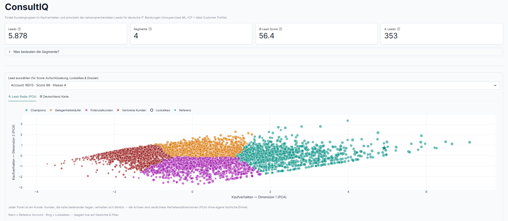

| "Why this score?" — explainable waterfall | Lookalike finder (cosine similarity) |
|:--:|:--:|
| 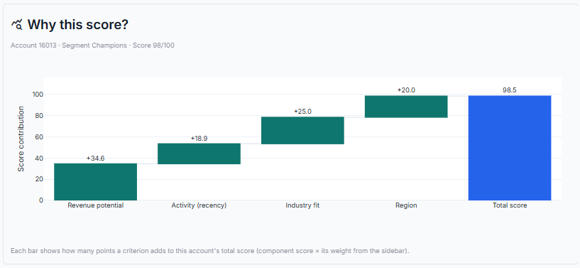 | 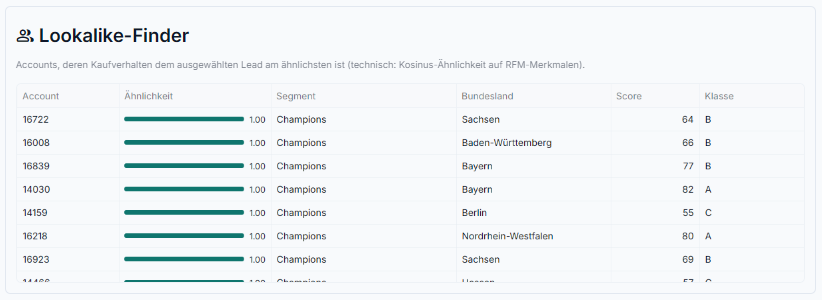 |

**Germany map** — leads per federal state (size = number of leads, colour = average lead score):

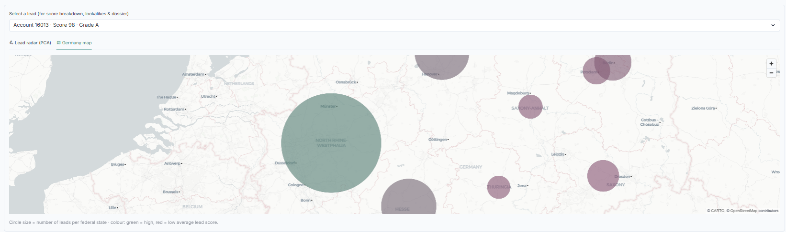

**Lead table & dossier export** — graded lead list (A–D) with Excel and PDF one-pager export:

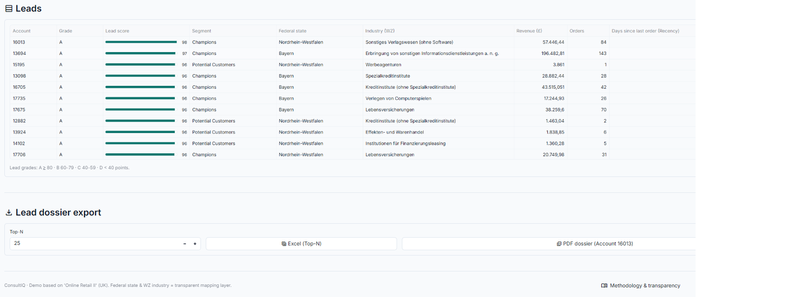

| Guided demo — to an A-lead list in under a minute | Sidebar — live weights, filters, EN/DE |
|:--:|:--:|
| 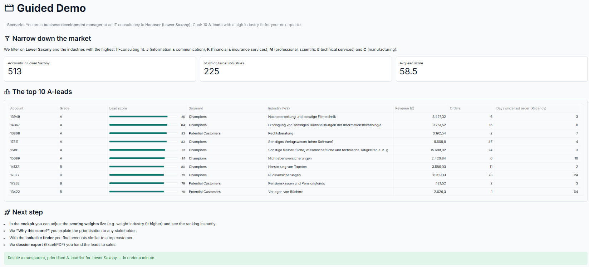 | 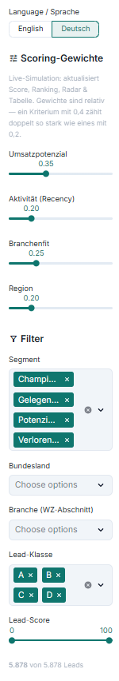 |

## 🔬 Methodology

**Preprocessing.** Monetary features in transaction data are heavily right-skewed. All clustering features are therefore compressed with **`log1p`** and **standardised** before K-Means and PCA see them — otherwise a handful of very large customers would dominate both the distance metric and the projection.

**Choosing k — three independent diagnostics.** K-Means was evaluated for k = 3–8:

| k | Silhouette ↑ | Davies-Bouldin ↓ | Inertia |
|--:|--:|--:|--:|
| 3 | 0.3478 | 1.0355 | 6,352 |
| **4** | **0.3653** | **0.9303** | **4,919** |
| 5 | 0.3421 | 0.9505 | 4,098 |
| 6 | 0.3336 | 0.9619 | 3,553 |
| 7 | 0.3052 | 0.9787 | 3,185 |
| 8 | 0.2970 | 0.9884 | 2,892 |

**Both validation metrics independently support k = 4**: the silhouette score peaks at 0.3653 and Davies-Bouldin bottoms out at 0.9303 — and the elbow curve flattens visibly after k = 4.

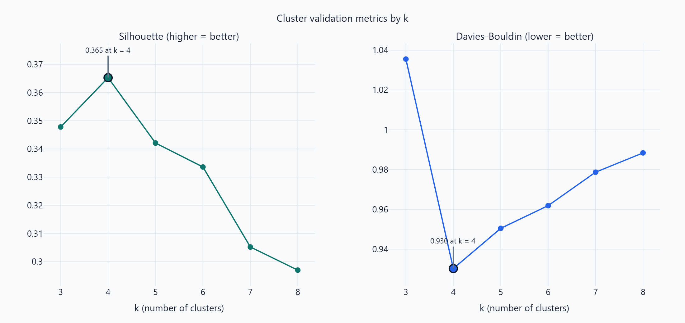

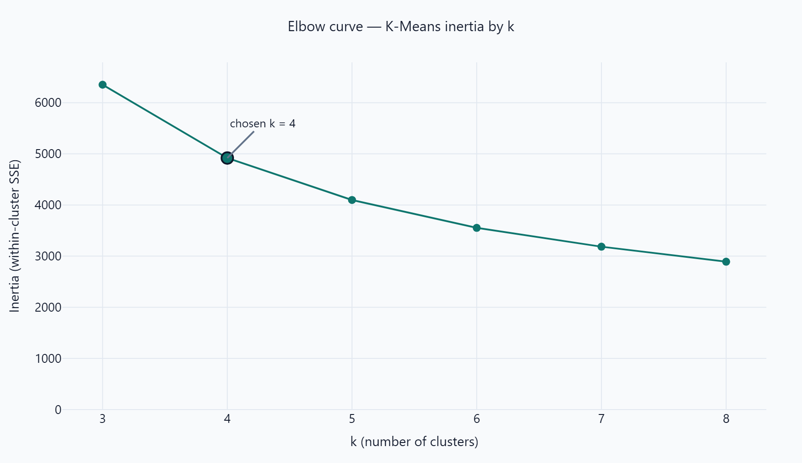

**Outliers.** DBSCAN runs alongside K-Means and flags 4 extreme accounts, so they can't distort the segment profiles.

**CLV is deliberately *not* a clustering feature.** The annualised CLV proxy correlates strongly with the monetary dimension by construction — clustering on both would double-weight revenue. CLV therefore enters only the lead score, as a scale-free percentile.

**The lead score is a reasoned, transparent heuristic — not a black box.** There is no conversion/outcome target in the data to train on, so pretending to have a predictive model would be dishonest. Instead, four normalised 0–100 components are precomputed and combined as a weighted sum whose weights are exposed as live controls in the app:

| Component | Basis | Default weight |
|---|---|--:|
| Revenue potential | Rank among all accounts by estimated annual value (CLV percentile) | 0.35 |
| Industry fit | IT-consulting affinity of the account's WZ-2008 industry | 0.25 |
| Activity (recency) | Rank by how recently the account last ordered | 0.20 |
| Region | Economic strength of the federal state | 0.20 |

**Data honesty.** The underlying dataset is *Online Retail II* (UK retail, 2009–2011). Federal state and WZ-2008 industry are a **deliberately transparent, rule-based demo mapping layer** — disclosed prominently in the app itself, on its Methodology & Transparency page:

<b>📖 The app documents its own methodology — click for screenshots</b>

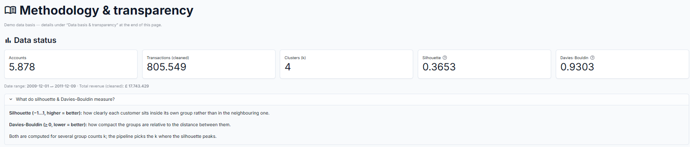

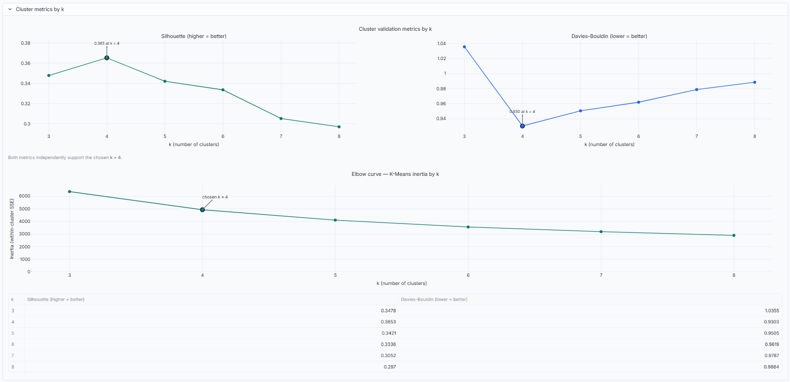

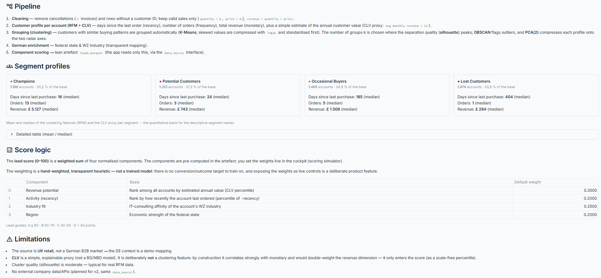

## 📈 Results

**Data basis:** 5,878 B2B accounts from 805,549 cleaned transactions (2009-12-01 → 2011-12-09, ≈ £17.7M cleaned revenue); DBSCAN flags 4 outliers.

**Model:** k = 4 segments — silhouette 0.3653 (maximum) and Davies-Bouldin 0.9303 (minimum) support the choice independently of each other.

**Segment profiles** (mean / median of the clustering features per segment — the quantitative basis for the segment names):

| Segment | Accounts | Share | Recency (days) | Frequency (orders) | Monetary (£) | CLV proxy (£) |
|---|--:|--:|--:|--:|--:|--:|
| **Champions** | 1,188 | 20.2% | 27.4 / 16.5 | 19.3 / 13.0 | 11,014 / 5,127 | 7,469 / 3,354 |
| **Potential Customers** | 1,251 | 21.3% | 28.4 / 24.0 | 3.0 / 3.0 | 865 / 743 | 3,224 / 1,540 |
| **Occasional Buyers** | 1,465 | 24.9% | 227.9 / 185.0 | 5.1 / 5.0 | 2,002 / 1,509 | 4,614 / 1,730 |
| **Lost Customers** | 1,974 | 33.6% | 395.9 / 404.0 | 1.4 / 1.0 | 326 / 284 | 2,991 / 2,230 |

With the **default weights**, the cockpit grades **353 accounts as A-leads** (score ≥ 80), and the **average lead score across the base is 56.4** — both figures are computed at those default weights and update live as you move the sliders. That A-list is a shortlist a BD team can actually work through.

## 🛠️ Tech stack

`Python 3.12` · `Streamlit 1.51` · `pandas` · `scikit-learn` · `Plotly` · `PyDeck` · `pyarrow` · `pytest`

**Engineering quality**

- ✅ **53 automated tests** (pytest) — pipeline logic, scoring and exports, plus Streamlit `AppTest` smoke tests of the app itself
- 🌍 **Bilingual UI (EN/DE)** via a central i18n layer — no hardcoded display strings
- 🎨 **Colour palette validated for colour-vision deficiency** — worst adjacent segment pair ΔE 16.4 under CVD simulation, all contrasts ≥ 3:1
- 📌 Pinned dependencies and fixed random seeds — the data artifact is fully reproducible

## 🏗️ Architecture

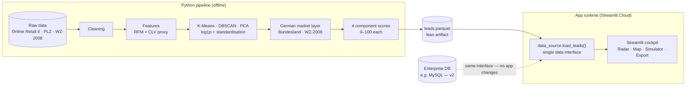

**DB-ready by design.** The app never reads files or databases directly — every byte of data flows through **one swappable interface** (`data_source.load_leads()`). In v1 that interface serves a lean, precomputed Parquet artifact; exchanging it for a company database (e.g. **MySQL**, local/on-premise) is a swap behind the interface — **no rebuild of the app required**. The interface seam for MySQL already exists (a documented stub).

## 🗺️ Roadmap

All three tracks are designed into the architecture and **can be implemented on request**:

| Track | What it adds | How it plugs in |
|---|---|---|
| 🗄️ **MySQL connection** | Serve leads live from a company database (local/on-premise) instead of the Parquet artifact | The `data_source` interface already contains the MySQL seam (a documented stub) — zero app changes |
| 🎯 **Trained lead scoring** | Replace the hand-set weights with a trained model as soon as real conversion data exists | The four component scores stay; only the weighting is learned instead of set |
| 🏢 **External company-data APIs** | Real firmographics (industry, region, size) instead of the transparent demo mapping | Swaps the enrichment stage of the pipeline — app and score logic unchanged |

## 📬 Contact

**End-to-end solo build** — pipeline, ML, UI, i18n, tests and deployment, by one person.

- 👔 **Recruiters & hiring managers** — I'm a **Data Scientist & Business Process Analyst** looking for roles in **IT consulting / data**. Happy to walk through the code and the modelling decisions.
- 🏢 **Interested in the service itself?** The model adapts to other industries, regions and scoring logics — **adaptation and extension on request**.

**[LinkedIn »](https://www.linkedin.com/in/baris-aydin-engineering/)** · **[GitHub »](https://github.com/baris2828)** · a source-code walkthrough is available on request.

**👉 [Try the live demo](https://consultiq.streamlit.app/)**

Built by **Baris Aydin** · Data Science Portfolio

